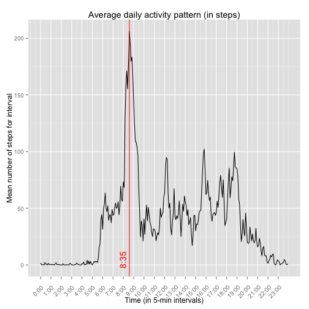
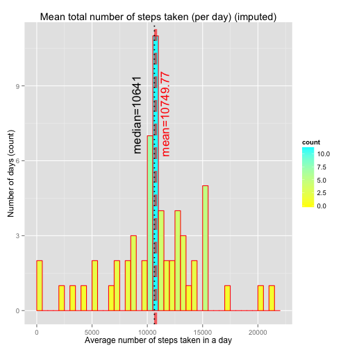
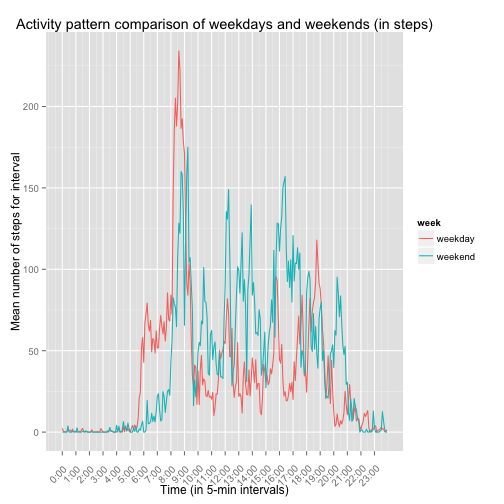

# Reproducible Research: Peer Assessment 1


## Loading and preprocessing the data

```r
setwd('~/git-repos/RepData_PeerAssessment1')

dataDir <- './data'
if (!file.exists(dataDir)) {
  dir.create(dataDir)
}

dataFile <- paste(dataDir, '/repdata-data-activity.zip', sep='')
dataURL <- 'https://d396qusza40orc.cloudfront.net/repdata%2Fdata%2Factivity.zip'
download.file(dataURL, dataFile, method='curl')
unzip(dataFile, exdir=dataDir)

activity <- read.csv(paste(dataDir, '/activity.csv', sep=''))

summary(activity)
```

```
##      steps                date          interval     
##  Min.   :  0.00   2012-10-01:  288   Min.   :   0.0  
##  1st Qu.:  0.00   2012-10-02:  288   1st Qu.: 588.8  
##  Median :  0.00   2012-10-03:  288   Median :1177.5  
##  Mean   : 37.38   2012-10-04:  288   Mean   :1177.5  
##  3rd Qu.: 12.00   2012-10-05:  288   3rd Qu.:1766.2  
##  Max.   :806.00   2012-10-06:  288   Max.   :2355.0  
##  NA's   :2304     (Other)   :15840
```

```r
str(activity)
```

```
## 'data.frame':	17568 obs. of  3 variables:
##  $ steps   : int  NA NA NA NA NA NA NA NA NA NA ...
##  $ date    : Factor w/ 61 levels "2012-10-01","2012-10-02",..: 1 1 1 1 1 1 1 1 1 1 ...
##  $ interval: int  0 5 10 15 20 25 30 35 40 45 ...
```

The dplyr package will be used for data manipulation.


```r
library(dplyr)

steps <- tbl_df(activity)
```


## What is the mean total number of steps taken per day?

Grouping by date should work nicely here.


```r
DailyActivity <- steps %>%
  group_by(date) %>%
  summarize(dailySteps=sum(steps))
```

Create a df with the mean and median statistics to lay them over the plot.


```r
vline.data <- data.frame(statistic= c('mean', 'median'),
                         value=c(mean(DailyActivity$dailyStep, na.rm=T), 
                                 median(DailyActivity$dailyStep, na.rm=T)))

vline.data <- vline.data %>%
  mutate(label=paste(statistic, '=', round(value, 2), sep=''))
```

A histogram of the average daily steps with overall mean and median.


```r
library(ggplot2)

ggplot(DailyActivity, aes(dailySteps)) +
  geom_histogram(breaks=seq(0, 22000, by=500),
                 col='red',
                 aes(fill=..count..)) +
  scale_fill_gradient('count', low='yellow', high='cyan') +
  geom_vline(data=vline.data, 
             mapping=aes(xintercept=value),
             col=c('red', 'black'), 
             size=c(2, .8), 
             linetype=c('dashed', 'dotted'),
             alpha=c(.6, 1.0),
             show_guide=T) +
  geom_text(data=vline.data,
            mapping=aes(x=value, y=0, label=label),
            size=6,
            angle=90,
            vjust=c(1.6, -1.6),
            hjust=c(-1.8, -2),
            color=c('red', 'black')) +
  labs(x='Average number of steps taken in a day',
       y='Number of days (count)',
       title='Mean total number of steps taken (per day)')
```

 


## What is the average daily activity pattern?

It is important to get the actual time scale from the interval labels.


```r
library(stringr)

DailyPattern <- steps %>%
  mutate(interval=as.character(interval)) %>%
  mutate(interval=str_pad(interval, 4, pad='0')) %>%
  mutate(hour=str_sub(interval, 1, 2), minute=str_sub(interval, 3, 4)) %>%
  mutate(time=as.numeric(hour)*60+as.numeric(minute)) %>%
  group_by(time) %>%
  summarize(meanSteps=mean(steps, na.rm=T))
```

Calculate the maximum average steps taken in an interval. Note that, in general, there can be a set of intervals with the same (maximum) number of steps. Therefore, a data frame is used for the overlay.


```r
maxSteps <- max(DailyPattern$meanSteps)
MaxSteps <- data.frame(DailyPattern[DailyPattern$meanSteps==maxSteps,])
max.steps.data <- MaxSteps %>%
  mutate(time=as.integer(time))
```

A time series plot of the average daily activity pattern.


```r
ggplot(DailyPattern, aes(time, meanSteps, group=1)) +
  geom_line() +
  theme(axis.text.x=element_text(angle=45,vjust=.5, hjust=.8, size=10)) +
  geom_vline(data=max.steps.data,
             mapping=aes(xintercept=time),
             col='red') +
  geom_text(data=max.steps.data,
            mapping=aes(x=time, y=0, 
                        label=paste(as.integer(time/60), ':', 
                                    str_pad(time%%60, 2, pad='0'), sep='')),
            angle=90,
            vjust=-0.5,
            hjust=0.2,
            color='red') +
  scale_x_continuous(breaks=seq(0, 1435, by=60),
                     labels=function(x) { paste(x/60, ':', str_pad(x%%60, 2, pad='0'), sep='')}) +
  labs(x='Time (in 5-min intervals)',
       y='Mean number of steps for interval',
       title='Average daily activity pattern (in steps)')
```

 

The 5-min interval at 8:35 contains the __largest mean value of steps__, possibly corresponding to the middle of a morning jog or running to work.

## Imputing missing values

How many steps values are missing in the dataset?

```r
sum(is.na(steps$steps))
```

```
## [1] 2304
```
For how many days are values missing altogether?

```r
sum(is.na(DailyActivity$dailySteps))
```

```
## [1] 8
```

Since there are whole days for which there is no data, the easiest impute strategy that decreases the bias is to use the already computed interval averages from the data pattern df.


```r
DailyPattern_no_mut <- steps %>%
  group_by(interval) %>%
  summarize(meanSteps=mean(steps, na.rm=T))
imputeMerge <- merge(x=steps, y=DailyPattern_no_mut, by="interval", mode="integer")
imputed_activity <- imputeMerge %>%
  mutate(steps=ifelse(is.na(steps), as.integer(meanSteps), steps)) %>%
  select(steps, date, interval)

imputed_steps <- tbl_df(imputed_activity)
```
Now the steps and imputed_steps df can be compared.

```r
summary(steps)
```

```
##      steps                date          interval     
##  Min.   :  0.00   2012-10-01:  288   Min.   :   0.0  
##  1st Qu.:  0.00   2012-10-02:  288   1st Qu.: 588.8  
##  Median :  0.00   2012-10-03:  288   Median :1177.5  
##  Mean   : 37.38   2012-10-04:  288   Mean   :1177.5  
##  3rd Qu.: 12.00   2012-10-05:  288   3rd Qu.:1766.2  
##  Max.   :806.00   2012-10-06:  288   Max.   :2355.0  
##  NA's   :2304     (Other)   :15840
```

```r
sum(is.na(steps$steps))
```

```
## [1] 2304
```

```r
summary(imputed_steps)
```

```
##      steps                date          interval     
##  Min.   :  0.00   2012-10-01:  288   Min.   :   0.0  
##  1st Qu.:  0.00   2012-10-02:  288   1st Qu.: 588.8  
##  Median :  0.00   2012-10-03:  288   Median :1177.5  
##  Mean   : 37.33   2012-10-04:  288   Mean   :1177.5  
##  3rd Qu.: 27.00   2012-10-05:  288   3rd Qu.:1766.2  
##  Max.   :806.00   2012-10-06:  288   Max.   :2355.0  
##                   (Other)   :15840
```

```r
sum(is.na(imputed_steps$steps))
```

```
## [1] 0
```
Now the same DailyActivity histogram with global mean and median can be plotted.

```r
DailyActivity_imputed <- imputed_steps %>%
  group_by(date) %>%
  summarize(dailySteps=sum(steps))

vline.data.imputed <- data.frame(statistic= c('mean', 'median'),
                         value=c(mean(DailyActivity_imputed$dailyStep, na.rm=T), 
                                 median(DailyActivity_imputed$dailyStep, na.rm=T)))

vline.data.imputed <- vline.data.imputed %>%
  mutate(label=paste(statistic, '=', round(value, 2), sep=''))

ggplot(DailyActivity_imputed, aes(dailySteps)) +
  geom_histogram(breaks=seq(0, 22000, by=500),
                 col='red',
                 aes(fill=..count..)) +
  scale_fill_gradient('count', low='yellow', high='cyan') +
  geom_vline(data=vline.data.imputed, 
             mapping=aes(xintercept=value),
             col=c('red', 'black'), 
             size=c(2, .8), 
             linetype=c('dashed', 'dotted'),
             alpha=c(.6, 1.0),
             show_guide=T) +
  geom_text(data=vline.data.imputed,
            mapping=aes(x=value, y=0, label=label),
            size=6,
            angle=90,
            vjust=c(1.6, -1.6),
            hjust=c(-1.8, -2),
            color=c('red', 'black')) +
  labs(x='Average number of steps taken in a day',
       y='Number of days (count)',
       title='Mean total number of steps taken (per day) (imputed)')
```

 

In the calculation of mean daily steps, NA values act as silent zeros. Therefore the adopted impute strategy necessarily errs on the side of __more steps__. The number of steps added to the dataset by the imputation strategy is


```r
sum(DailyActivity_imputed$dailySteps) - sum(DailyActivity$dailySteps, na.rm=T)
```

```
## [1] 85128
```

There is almost a 13% increase in the number of steps after imputing the missing values, about the same amount that were missing in the original dataset. This can be seen in the histogram where the bars have larger height than the ones for the dataset with NA values ignored. The mean and median are also higher. In this sense, the imputation strategy introduces its own bias.

On the other hand, this strategy has a "smoothing" effect since:

 * The differences in the mean and median statistics are smaller than the differences of the bars between the two histograms.
 * The histogram is more closely balanced around the bar corresponding to the number of days for which the highest number of steps were taken.

## Are there differences in activity patterns between weekdays and weekends?

A factor variable can be introduced to slice the data into 'weekend' and 'weekday' bins. Otherwise, the same approach as in the daily pattern is followed.


```r
WeeklyPattern <- steps %>%
  mutate(week=ifelse(weekdays(as.Date(date)) %in% c('Saturday', 'Sunday'), 
                     'weekend', 'weekday')) %>%
  mutate(interval=as.character(interval)) %>%
  mutate(interval=str_pad(interval, 4, pad='0')) %>%
  mutate(hour=str_sub(interval, 1, 2), minute=str_sub(interval, 3, 4)) %>%
  mutate(time=as.numeric(hour)*60+as.numeric(minute)) %>%
  group_by(week, time) %>%
  summarize(meanSteps=mean(steps, na.rm=T))
```

A time-series comparison of the weekday and weekend activity patterns.


```r
ggplot(WeeklyPattern, aes(time, meanSteps, group=week)) +
  geom_line(aes(col=week)) +
  theme(axis.text.x=element_text(angle=45,vjust=.5, hjust=.8, size=10)) +
  scale_x_continuous(breaks=seq(0, 1435, by=60),
                     labels=function(x) { paste(x/60, ':', str_pad(x%%60, 2, pad='0'), sep='')}) +
  labs(x='Time (in 5-min intervals)',
       y='Mean number of steps for interval',
       title='Activity pattern comparison of weekdays and weekends (in steps)')
```

 

A panel plot of the same data.


```r
ggplot(WeeklyPattern, aes(time, meanSteps)) +
  geom_line(aes(col=week)) +
  facet_wrap(~week, ncol=1) +
  theme(axis.text.x=element_text(angle=45,vjust=.5, hjust=.8, size=10)) +
  scale_x_continuous(breaks=seq(0, 1435, by=60),
                     labels=function(x) { paste(x/60, ':', str_pad(x%%60, 2, pad='0'), sep='')}) +
  labs(x='Time (in 5-min intervals)',
       y='Mean number of steps for interval',
       title='Activity pattern comparison of weekdays and weekends (in steps)')
```

 

The weekend pattern shows a more even high-activity pattern, possibly corresponding to day- or weekend-long recreational activities or house cleaning. The weekend activity is more sustained, and starts and stops later in the day, in comparison to the weekday pattern.
